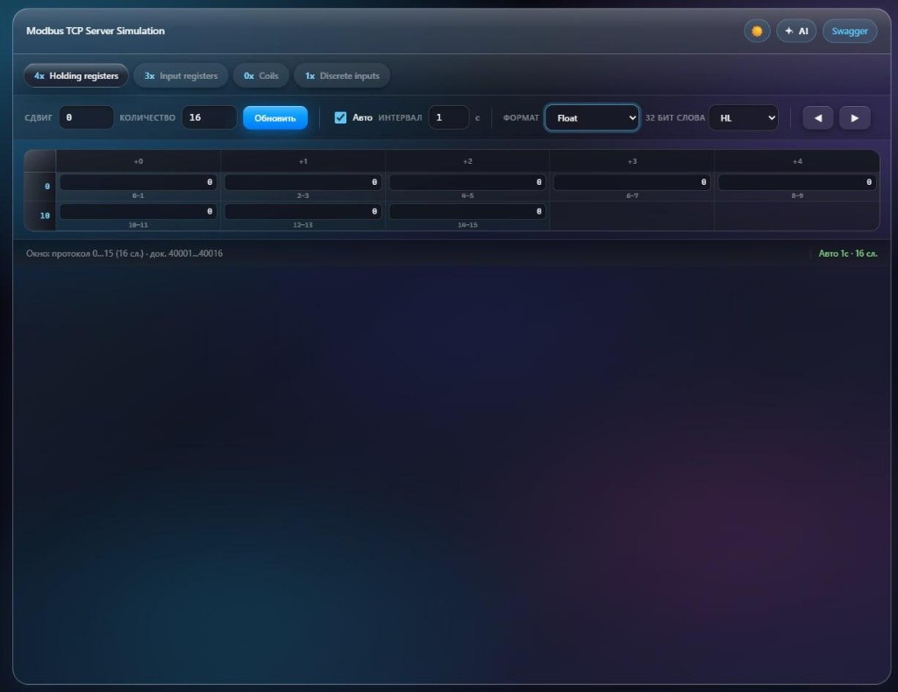

<div align="center">

# Modbus TCP Server Simulation

[](https://hub.docker.com/r/allexd2010/modbus-server-sim)
[](https://github.com/Allexd1992/modbus-tcp-simulation)
[](https://www.rust-lang.org/)
[](https://opensource.org/licenses/MIT)

**Modbus TCP Server ·  In-memory store · Web UI · REST · Swagger · MCP over HTTP**

<br/>



*Modern dark glassmorphism UI: register matrix, Float / 32-bit word order, auto-refresh, Swagger & AI.*

<br/>

</div>

---

A **Modbus TCP** simulator with a **single in-memory store**: web UI, **REST API**, **Swagger**, and **MCP (Model Context Protocol)** over HTTP for clients such as Cursor. Built with **Rocket**, **tokio-modbus**, and **rmcp**.

## ✨ Features

- **Modbus TCP** — holding/input registers, coils, and discrete inputs.
- **REST** — the same data as Modbus and MCP.
- **Web UI** (`/ui/`) — register matrix, UInt16/Int32/float/double formats, bitmask, auto-refresh with configurable interval, MCP hint with `mcp.json` example and download. **English** (default) and **Russian** via **EN** / **RU** in the title bar; choice is stored in the browser.
- **MCP** — Streamable HTTP at `/mcp`, tools such as `modbus_read_holding_registers`, `modbus_write_holding_registers`, and more.
- **Installable PWA** — open the UI in **Chrome** or **Edge** at `http://127.0.0.1:9090/ui/` (or your host); after the page loads, use **Install** in the address bar (same idea as **YouTube** / **Spotify** web: standalone window, no tabs). Uses `manifest.json` + a minimal service worker under `/ui/`.

## 📋 Requirements

- **From source:** Rust toolchain.
- **Container:** Docker (or pull-only from Docker Hub).

## 🚀 Quick start

### Docker Hub image (recommended)

Current tag (example): **`2.1.1`**.

```bash
docker pull allexd2010/modbus-server-sim:2.1.1

docker run -d --name modbus-sim \
  -p 9090:9090 \
  -p 502:502 \
  -p 18081:8081 \
  allexd2010/modbus-server-sim:2.1.1
```

| Host | Container | Purpose |
|------|-----------|---------|
| 9090 | 9090 | HTTP: REST, Swagger, `/ui/` |
| 502 | 502 | Modbus TCP |
| **18081** | **8081** | MCP (`http://<host>:18081/mcp`) |

**Why 18081 on the host:** MCP listens inside the process on `MCP_SERVER_PORT` (default **8081**). Mapping `18081:8081` matches the web UI hint for Cursor. For MCP on the host as **8081**, use `-p 8081:8081`.

Build the image locally:

```bash
docker build -t allexd2010/modbus-server-sim:2.1.1 .
```

### Docker Compose

```bash
docker compose up -d
```

Ports and image are defined in `docker-compose.yml`.

### Without Docker

```bash
cargo run --release
```

Defaults: web **9090**, Modbus **502**, MCP **8081** (see environment variables below). UI: `http://127.0.0.1:9090/ui/`.

### Install as app (PWA)

1. Start the server (`cargo run --release` or Docker with port **9090** published).
2. Open **`http://127.0.0.1:9090/ui/`** in **Chrome** or **Microsoft Edge** (secure context: `localhost` / `127.0.0.1` works).
3. When the browser shows **Install** in the address bar (or menu → *Install this site as an app*), confirm — the UI opens in its **own window** without the normal browser toolbar.

The installed app still talks to the **same origin** as the page; keep the backend running. For a remote server, use that host in the URL before installing.

## 🌐 Services after startup

| Service | URL / address |
|---------|----------------|
| Web UI | `http://<host>:9090/ui/` |
| Swagger | `http://<host>:9090/api/v1/swagger/` |
| REST | base prefix `/api/v1/` |
| Modbus TCP | `<host>:502` (or the port from `MB_SERVER_PORT` and your Docker `-p` mapping) |
| MCP | `http://<host>:<MCP port on host>/mcp` |

## 🖥️ Web UI

- Tabs: holding / input / coils / discrete inputs.
- **Offset** and **Count** set the read window. Limits come from the server (`MB_MAX_ADDRESS`, `MB_MAX_READ_COUNT`; defaults **65535** each). The UI loads them from **`GET /api/v1/ui-config`** so inputs stay in sync. The register matrix scrolls inside the grid area.
- **Auto** — periodic reads; interval in seconds; while a cell is focused, auto-refresh does not overwrite your input.
- **AI** — MCP help text, current URL for Cursor, `mcp.json` download (host as on the page, port **18081** by default, or `?mcpPort=` in the page URL).

## 📍 Modbus addressing

The protocol and API use **zero-based offsets** (the first holding register is address **0**). Modicon-style docs: holding **40001** → offset **0**, **40021** → **20**.

## 🔌 REST API (short)

All routes are under `/api/v1/`; holding examples:

- `GET /api/v1/ui-config` — JSON `max_modbus_address`, `max_read_count` (same limits as env vars below; used by the web UI)
- `GET /api/v1/holding-registers/{addr}/{cnt}` — read
- `POST /api/v1/holding-register/{addr}/{data}` — single word
- `POST /api/v1/holding-registers/{addr}` — JSON body `{"data":[…]}`

Read/write requests that exceed the configured limits return **400**. Same URL patterns for input, coils, and discrete — see Swagger.

## 🤖 MCP (Cursor and others)

- Transport: **Streamable HTTP**, endpoint **`/mcp`**.
- Same store as REST.
- In tools, **`addr`** is the **protocol offset**, not a 40001-style number.

Example `mcp.json` (global `%USERPROFILE%\.cursor\mcp.json` or project `.cursor/mcp.json`):

```json
{
  "mcpServers": {
    "modbus-tcp-sim": {
      "url": "http://127.0.0.1:18081/mcp"
    }
  }
}
```

With local `cargo run` and no Docker, usually: `http://127.0.0.1:8081/mcp`. After changing the config, **fully restart** Cursor.

Disable MCP: `MCP_SERVER_PORT=0`.

## ⚙️ Environment variables

| Variable | Default | Description |
|----------|---------|-------------|
| `WEB_SERVER_PORT` | `9090` | HTTP (REST, Swagger, static `/ui`) |
| `MB_SERVER_PORT` | `502` | Modbus TCP |
| `MCP_SERVER_PORT` | `8081` | MCP port inside the process; **`0`** — do not start MCP |
| `MB_MAX_ADDRESS` | `65535` | Maximum **protocol address** (inclusive). The window `addr` … `addr + cnt - 1` must not pass this bound. |
| `MB_MAX_READ_COUNT` | `65535` | Maximum **words or bits** in one HTTP read, and maximum **elements** in one batch write body. |
| `RUST_LOG` | (none) | Log level, e.g. `info` |

**Modbus clients:** use the host port mapped from `MB_SERVER_PORT` (default **502**). The **`MB_MAX_*`** variables apply to the **HTTP REST API** (and what the web UI calls), not to raw Modbus TCP frame limits inside `tokio-modbus`.

## 🔧 Troubleshooting

- **Port in use** — check `netstat` / Task Manager; change `-p` mappings or environment variables.
- **MCP not responding in Cursor** — ensure the URL uses the **host and published port** of the container (often **18081**, not 8081).
- **Empty or wrong data in the UI** — the API must return a **JSON array**; HTML from a proxy will not fill the table.

## 📦 Image & registry

- Docker Hub: `allexd2010/modbus-server-sim`
- Tags: e.g. **`2.1.1`**

## 🔩 Git: strip `Made-with: Cursor` from commits

This repo ships a **`commit-msg`** hook under **`.githooks/`** that removes lines like `Made-with: Cursor` (so they are not stored in history). Enable once per clone:

```bash
git config core.hooksPath .githooks
```

To turn the hook off: `git config --unset core.hooksPath`. To remove such lines from **past** commits, use `git rebase -i` / `filter-repo` (not covered here).

## 📄 License

MIT

---

<p align="center"><strong>Documentation</strong> · example image tag <code>2.1.1</code></p>
