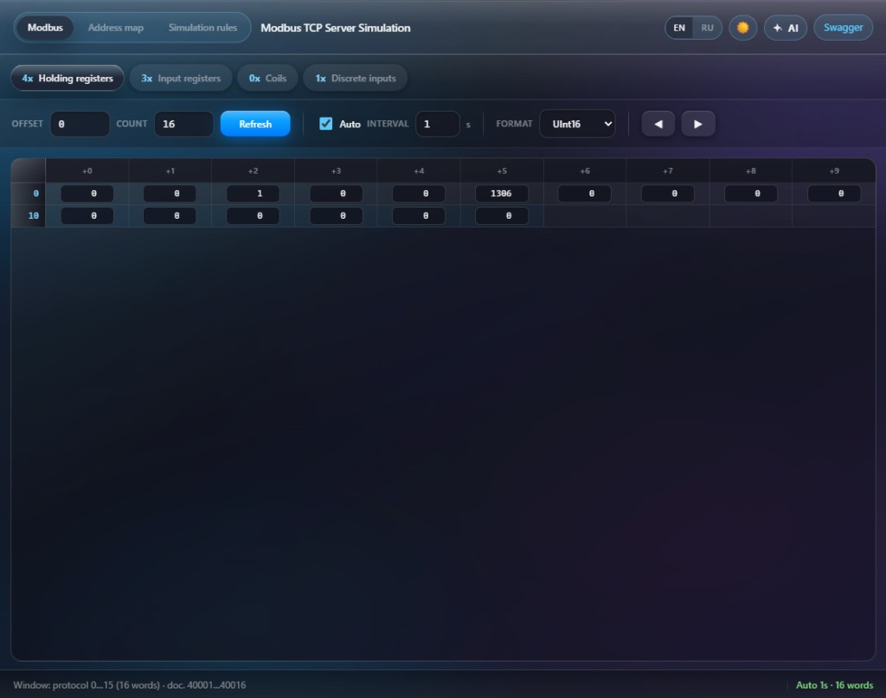

<div align="center">

# Modbus TCP Server Simulation

[](https://hub.docker.com/r/allexd2010/modbus-server-sim)
[](https://github.com/Allexd1992/modbus-tcp-simulation)
[](https://www.rust-lang.org/)
[](https://nodejs.org/)
[](https://github.com/Allexd1992/modbus-tcp-simulation/tags)
[](https://opensource.org/licenses/MIT)

**Modbus TCP Server ·  In-memory store · Web UI · REST · Swagger · MCP over HTTP**

<br/>



*Modern dark glassmorphism UI: register matrix, Float / 32-bit word order, auto-refresh, Swagger & AI.*

<br/>

</div>

---

A **Modbus TCP** simulator with a **single in-memory store**: web UI, **REST API**, **Swagger**, and **MCP (Model Context Protocol)** over HTTP for clients such as Cursor. Built with **Rocket**, **tokio-modbus**, and **rmcp**.

## ✨ Features

- **Modbus TCP** — holding/input registers, coils, and discrete inputs.
- **JavaScript simulation scripts** — server-side QuickJS scripts in `script/` react to register writes and run on timers (see below).
- **REST** — the same data as Modbus and MCP.
- **Web UI** (`/ui/`) — register matrix, UInt16/Int32/float/double formats, bitmask, auto-refresh with configurable interval, MCP hint with `mcp.json` example and download. **English** (default) and **Russian** via **EN** / **RU** in the title bar; choice is stored in the browser.
- **MCP** — Streamable HTTP at `/mcp`, tools such as `modbus_read_holding_registers`, `modbus_write_holding_registers`, and more.
- **Installable PWA** — open the UI in **Chrome** or **Edge** at `http://127.0.0.1:9090/ui/` (or your host); after the page loads, use **Install** in the address bar (same idea as **YouTube** / **Spotify** web: standalone window, no tabs). Uses `manifest.json` + a minimal service worker under `/ui/`.

## 📋 Requirements

- **From source:** Rust toolchain.
- **Container:** Docker (or pull-only from Docker Hub).

## 🚀 Quick start

### Docker Hub image (recommended)

Current tag: **`2.2.0`**.

```bash
docker pull allexd2010/modbus-server-sim:2.2.0

docker run -d --name modbus-sim \
  -p 9090:9090 \
  -p 502:502 \
  -e RUST_LOG=info \
  allexd2010/modbus-server-sim:2.2.0
```

| Host | Container | Purpose |
|------|-----------|---------|
| 9090 | 9090 | HTTP: REST, Swagger, `/ui/`, MCP `/mcp` |
| 502 | 502 | Modbus TCP |

Build the image locally:

```bash
docker build -t allexd2010/modbus-server-sim:2.2.0 .
```

### Docker Compose

```bash
docker compose up -d
```

Ports and image are defined in `docker-compose.yml`.

### Without Docker

```bash
cargo run --release
```

Defaults: web **9090** (UI + API + MCP at `/mcp`), Modbus **502**. UI: `http://127.0.0.1:9090/ui/`.

### Install as app (PWA)

1. Start the server (`cargo run --release` or Docker with port **9090** published).
2. Open **`http://127.0.0.1:9090/ui/`** in **Chrome** or **Microsoft Edge** (secure context: `localhost` / `127.0.0.1` works).
3. When the browser shows **Install** in the address bar (or menu → *Install this site as an app*), confirm — the UI opens in its **own window** without the normal browser toolbar.

The installed app still talks to the **same origin** as the page; keep the backend running. For a remote server, use that host in the URL before installing.

## 🌐 Services after startup

| Service | URL / address |
|---------|----------------|
| Web UI | `http://<host>:9090/ui/` |
| Swagger | `http://<host>:9090/api/v1/swagger/` |
| REST | base prefix `/api/v1/` |
| Modbus TCP | `<host>:502` (or the port from `MB_SERVER_PORT` and your Docker `-p` mapping) |
| MCP | `http://<host>:9090/mcp` (same port as UI/API) |

## 🖥️ Web UI

- Tabs: holding / input / coils / discrete inputs.
- **Offset** and **Count** set the read window. Limits come from the server (`MB_MAX_ADDRESS`, `MB_MAX_READ_COUNT`; defaults **65535** each). The UI loads them from **`GET /api/v1/ui-config`** so inputs stay in sync. The register matrix scrolls inside the grid area.
- **Auto** — periodic reads; interval in seconds; while a cell is focused, auto-refresh does not overwrite your input.
- **Scripts** — top bar **Modbus / Scripts**: edit server-side JavaScript (`*.js`), save with engine reload. Hidden when simulation scripts are disabled.
- **AI** — MCP help text, current URL for Cursor, `mcp.json` download (host as on the page, port **18081** by default, or `?mcpPort=` in the page URL).

## 📍 Modbus addressing

The protocol and API use **zero-based offsets** (the first holding register is address **0**). Modicon-style docs: holding **40001** → offset **0**, **40021** → **20**.

## 🔌 REST API (short)

All routes are under `/api/v1/`; holding examples:

- `GET /api/v1/ui-config` — JSON `max_modbus_address`, `max_read_count` (same limits as env vars below; used by the web UI)
- `GET /api/v1/holding-registers/{addr}/{cnt}` — read
- `POST /api/v1/holding-register/{addr}/{data}` — single word
- `POST /api/v1/holding-registers/{addr}` — JSON body `{"data":[…]}`

Read/write requests that exceed the configured limits return **400**. Same URL patterns for input, coils, and discrete — see Swagger.

## 🤖 MCP (Cursor and others)

- Transport: **Streamable HTTP**, endpoint **`/mcp`**.
- Same store as REST.
- In tools, **`addr`** is the **protocol offset**, not a 40001-style number.

**Modbus:** `modbus_read_holding_registers`, `modbus_write_holding_register`, … (all read/write tools from before).

**Address map:** `var_map_get`, `var_map_save`, `var_map_import` — same data as `/api/v1/var-map` (named variables for `map.*` in scripts; supports `type: "bit"` with `bit: 0…15`).

**Simulation rules:** `sim_scripts_list`, `sim_scripts_read`, `sim_scripts_write`, `sim_scripts_delete`, `sim_scripts_reload`, `sim_scripts_export`, `sim_scripts_import` (require script engine; disabled when `SIM_SCRIPTS_DISABLE`).

**Combined:** `simulation_export`, `simulation_import` — scripts + address map in one JSON bundle (`mode`: `merge` or `replace`).

Example `mcp.json` (global `%USERPROFILE%\.cursor\mcp.json` or project `.cursor/mcp.json`):

```json
{
  "mcpServers": {
    "modbus-tcp-sim": {
      "url": "http://127.0.0.1:9090/mcp"
    }
  }
}
```

After changing the config, **fully restart** Cursor.

Disable MCP: `MCP_SERVER_PORT=0`.

## 📜 Simulation scripts (JavaScript)

The backend runs **JavaScript** scripts from a directory (default **`./script`**) using an embedded **QuickJS** runtime. Scripts load at startup and share the same in-memory Modbus store as TCP, REST, and MCP.

**Triggers:**

- **`modbus.onWrite(kind, fn)`** — after any write to a register/coil (`holding`, `input`, `coil`, `discreteInput`): from Modbus TCP, REST, MCP, **or another script**. Callback: `(addr, values)`.
- **`modbus.setInterval(ms, fn)`** — periodic callback (minimum interval 1 ms).

**API from scripts:**

| Method | Description |
|--------|-------------|
| `modbus.holdingRead(addr, count?)` | Read holding register(s) |
| `modbus.inputRead(addr, count?)` | Read input register(s) |
| `modbus.coilRead(addr, count?)` | Read coil(s) |
| `modbus.discreteInputRead(addr, count?)` | Read discrete input(s) |
| `modbus.holdingWrite(addr, value)` | Write one word or array |
| `modbus.inputWrite(addr, value)` | Same for input registers |
| `modbus.coilWrite(addr, value)` | Write bool or array of bools |
| `modbus.discreteInputWrite(addr, value)` | Same for discrete inputs |

**Typed registers** (same layout as the web UI: Int32/Float32 use 2 words with optional word order `'HL'` default or `'LH'`; Double/Int64 use 4 words big-endian):

| Method | Description |
|--------|-------------|
| `modbus.holdingReadInt32(addr, order?)` / `holdingWriteInt32` | Signed 32-bit |
| `modbus.holdingReadFloat(addr, order?)` / `holdingWriteFloat` | IEEE754 float32 |
| `modbus.holdingReadDouble(addr)` / `holdingWriteDouble` | IEEE754 float64 |
| `modbus.holdingReadInt64(addr)` / `holdingWriteInt64` | Signed 64-bit (number or `{hi, lo}` parts) |
| `modbus.holdingReadInt64Parts(addr)` | `{ hi, lo }` without precision loss |
| `modbus.inputReadInt32` … `inputWriteInt64` | Same for input registers |

**Bits** (16-bit Modbus word, bit 0 = LSB):

| Method | Description |
|--------|-------------|
| `modbus.getBit(word, n)` | Read bit `n` (0…15) |
| `modbus.testBit(word, n)` | `true` if bit set |
| `modbus.setBit(word, n, on)` | Set/clear bit, returns new word |
| `modbus.getBits(word, start, len)` | Extract bit field |
| `modbus.setBits(word, start, len, value)` | Insert bit field, returns new word |
| `modbus.int64FromNumber(n)` / `int64ToNumber(hi, lo)` | Convert int64 parts ↔ number (safe range) |

**Address map (`map`)** — read/write named points from the **Address map** tab (stored in `conf/var-map.json`). Same typed layout as above:

| Method | Description |
|--------|-------------|
| `map.read(name)` / `map.get(name)` | Read by variable name |
| `map.write(name, value)` / `map.set(name, value)` | Write by name |
| `map.has(name)` | `true` if the name exists in the map |
| `map.list()` | Array of all variable names |
| `map.def(name)` | `{ name, kind, addr, type, order }` or `null` |
| `map.def(name).bit` | Bit index `0…15` when `type` is `"bit"` (LSB = b0) |
| `map.onChange(name, fn)` | After any write overlapping the variable: `fn(value, name)` |
| `map.onChange(fn)` | Watch all map variables: `fn(name, value)` |

`onChange` fires after writes from Modbus TCP, REST, MCP, or scripts (including `map.write`). The callback receives the **decoded** typed value (same as `map.read`).

Example:

```javascript
map.onChange("Temperature", function (value) {
  map.write("Alarm", value > 80);
});

map.onChange(function (name, value) {
  if (name === "HR0_counter") {
    /* … */
  }
});
```

Avoid feedback loops in `onWrite` handlers (e.g. writing the same address you react to).

Example (`script/example.js`):

```javascript
modbus.setInterval(1000, function () {
  var v = modbus.holdingRead(100);
  modbus.holdingWrite(100, (v + 1) % 65536);
});

modbus.onWrite('holding', function (addr, values) {
  if (addr !== 0) return;
  var v = Array.isArray(values) ? values[0] : values;
  modbus.inputWrite(0, v);
});
```

Mount custom scripts in Docker:

```bash
docker run -d -p 9090:9090 -p 502:502 \
  -v /path/to/my-scripts:/app/script \
  -v /path/to/my-conf:/app/conf \
  allexd2010/modbus-server-sim:2.2.0
```

**Web UI:** **Address map** tab — named Modbus points; **Export** / **Import** for the map. **Scripts** tab — edit `*.js` files; **Export** / **Import** scripts only, or **Export all** / **Import all** for scripts + map together. **Save** writes to disk and reloads the QuickJS engine; **Reload engine** applies on-disk files without editing.

REST (same as the UI):

- `GET /api/v1/sim-scripts` — list
- `GET /api/v1/sim-scripts/{name}` — read
- `PUT /api/v1/sim-scripts/{name}` — save body `{ "content": "…" }`
- `POST /api/v1/sim-scripts` — create `{ "name": "foo.js", "content": "…" }`
- `DELETE /api/v1/sim-scripts/{name}`
- `POST /api/v1/sim-scripts/reload` — reload engine
- `GET /api/v1/sim-scripts/export` — scripts JSON bundle
- `POST /api/v1/sim-scripts/import` — body `{ "version": 1, "scripts": […], "mode": "merge"|"replace" }`
- `GET /api/v1/var-map` / `PUT /api/v1/var-map` — read/save address map
- `GET /api/v1/var-map/export` — map JSON `{ "version": 1, "variables": […] }`
- `POST /api/v1/var-map/import` — body `{ "version": 1, "variables": […], "mode": "merge"|"replace" }`
- `GET /api/v1/simulation/export` — combined `{ "version": 1, "scripts": […], "varMap": {…} }`
- `POST /api/v1/simulation/import` — import scripts and/or `varMap` / top-level `variables`

| Variable | Default | Description |
|----------|---------|-------------|
| `SIM_SCRIPTS_DIR` | `script` (or `/app/script` in Docker) | **Only** directory for `*.js` simulation scripts (read/save). Legacy `scripts/` is merged into `script/` on startup and removed. |
| `SIM_SCRIPTS_DISABLE` | (unset) | Set to `1` or `true` to disable the script engine |
| `VAR_MAP_PATH` | `conf/var-map.json` (or `/app/conf/var-map.json` in Docker) | Named Modbus points for the **Address map** tab and `map.*` in scripts |

## ⚙️ Environment variables

| Variable | Default | Description |
|----------|---------|-------------|
| `WEB_SERVER_PORT` | `9090` | HTTP (REST, Swagger, static `/ui`) |
| `MB_SERVER_PORT` | `502` | Modbus TCP |
| `MCP_SERVER_PORT` | any non-zero | **`0`** disables MCP; when enabled, MCP is at **`/mcp`** on **`WEB_SERVER_PORT`** |
| `MB_MAX_ADDRESS` | `65535` | Maximum **protocol address** (inclusive). The window `addr` … `addr + cnt - 1` must not pass this bound. |
| `MB_MAX_READ_COUNT` | `65535` | Maximum **words or bits** in one HTTP read, and maximum **elements** in one batch write body. |
| `RUST_LOG` | `info` | Log level via [`tracing`](https://docs.rs/tracing). Examples: `info`, `debug`, `modbus_tcp_server_rust=debug,info`. HTTP static assets under `/ui/` are omitted at `info` to reduce noise. |

See **[CHANGELOG.md](CHANGELOG.md)** for release history.

**Modbus clients:** use the host port mapped from `MB_SERVER_PORT` (default **502**). The **`MB_MAX_*`** variables apply to the **HTTP REST API** (and what the web UI calls), not to raw Modbus TCP frame limits inside `tokio-modbus`.

## 📋 Logging

The backend uses structured logging (`tracing`). On startup you will see Modbus TCP bind, web/MCP status, script engine, and var-map path.

```bash
RUST_LOG=info cargo run --release          # default
RUST_LOG=debug cargo run --release         # HTTP requests + script load
RUST_LOG=modbus_tcp_server_rust=debug,info cargo run --release
```

In Docker / Compose, `RUST_LOG=info` is set by default. Static files under `/ui/` are not logged at `info` to reduce noise.

## 🔧 Troubleshooting

- **Port in use** — check `netstat` / Task Manager; change `-p` mappings or environment variables.
- **MCP not responding in Cursor** — URL must be `http://<host>:9090/mcp` (same port as the web UI).
- **Empty or wrong data in the UI** — the API must return a **JSON array**; HTML from a proxy will not fill the table.

## 📦 Image & registry

- Docker Hub: `allexd2010/modbus-server-sim`
- Tags: e.g. **`2.2.0`**
- **CI** (`.github/workflows/ci.yml`): on non-PR pushes, the image is built and pushed **only to Docker Hub** (`:test` on branches; `:latest` and `:<semver>` on release tags — image tag is **without** leading `v`, e.g. `2.2.0` even if the git tag is `v2.2.0`). **Platforms:** branch/test builds **`linux/amd64` only**; **release tags** add **`linux/arm64`** (multi-arch manifest). Set secrets **`DOCKERHUB_USERNAME`** and **`DOCKERHUB_TOKEN`** ([Docker Hub access token](https://hub.docker.com/settings/security)).

## 🔩 Git: strip `Made-with: Cursor` from commits

This repo ships a **`commit-msg`** hook under **`.githooks/`** that removes lines like `Made-with: Cursor` (so they are not stored in history). Enable once per clone:

```bash
git config core.hooksPath .githooks
```

To turn the hook off: `git config --unset core.hooksPath`. To remove such lines from **past** commits, use `git rebase -i` / `filter-repo` (not covered here).

## 📄 License

MIT

---

<p align="center"><strong>Documentation</strong> · latest tag <code>2.2.0</code></p>
